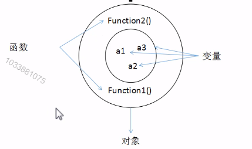
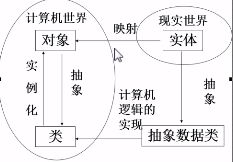

# 类 与 抽象

## 类

类是描述对象的 "基本原型"，它定义一类对象所能拥有的数据和能完成的操作。在面向对象的程序设计中，类是程序的基本单元。相似的对象可以归并到同一个类中去，就像传统语言中的变量与类型关系一样。

程序中的对象是类的一个实例，是一软件单元，它由一组结构化的数据和在其上的一组操作构成.

类与对象的关系 ： **类是好多对象的抽象，对象是类的实例化.**



## 抽象

定义 ： 对具体问题（对象）进行概括，抽出这一类对象的公共性质并加以描述的过程.

数据抽象 --- 描述某类对象的属性或状态（对象互相区别的物理量）.

代码抽象 --- 描述某类对象的共有的行为特征或具有的功能.

如何实现抽象 ：对问题进行分析，提取其属性和行为.



## 类的定义语法：

```C#
[访问修饰符][修饰符] class_name [：<基类名>][,<接口列表>]
{
    构造方法；
    析构方法；
    [<访问控制符>][<修饰符>]数据类型<变量名>；
    [<访问控制符>][<修饰符>]数据类型<属性名>；
    ...
    [<访问控制符>][<修饰符>]<返回值类型><方法名>([参数列表])；
}
```

类的成员变量在类的主体中，且不在方法体中声明.

类的成员方法中可以声明变量，称为局部变量。局部变量的作用域在方法内部，可与成员变量同名。

如果类的成员方法有返回值，方法中必须以 return 语句返回，程序执行到 return 就返回而忽略其后所有语句；否则，return 可省略。

返回类型可以是任意的数据类型，当一个方法不需要返回值时，返回类型为 void .


## 类的实例化

- 声明对象（引用变量）：

```C#
类名 变量名
```

- 对象实例化：

```C#
new <class_name>)([参数列表])
```

- 将引用指向实例格式：

```C#
变量名 = new<类名>([<参数列表>])
```

- 引用对象的成员变量和调用对象方法：

```C#
对象.成员变量
对象.成员方法([参数列表])
```

- 对象的构造过程
  
1. 为对象开辟空间
2. 调用构造方法初始化
3. 返回对象的引用

- 类是对象的模板，同一个类可以创建多个对象，每个对象有各自的内存空间，不会互相影响.
  
```C#
using System;

public class Person
{
    // Constructor that takes no arguments:
    public Person()
    {
        Name = "unknown";
    }

    // Constructor that takes one argument:
    public Person(string name)
    {
        Name = name;
    }

    // Auto-implemented readonly property:
    public string Name { get; }

    // Method that overrides the base class (System.Object) implementation.
    public override string ToString()
    {
        return Name;
    }
}
class TestPerson
{
    static void Main()
    {
        // Call the constructor that has no parameters.
        var person1 = new Person();
        Console.WriteLine(person1.Name);

        // Call the constructor that has one parameter.
        var person2 = new Person("Sarah Jones");
        Console.WriteLine(person2.Name);
        // Get the string representation of the person2 instance.
        Console.WriteLine(person2);

        Console.WriteLine("Press any key to exit.");
        Console.ReadKey();
    }
}

// Output:
// unknown
// Sarah Jones
// Sarah Jones
```